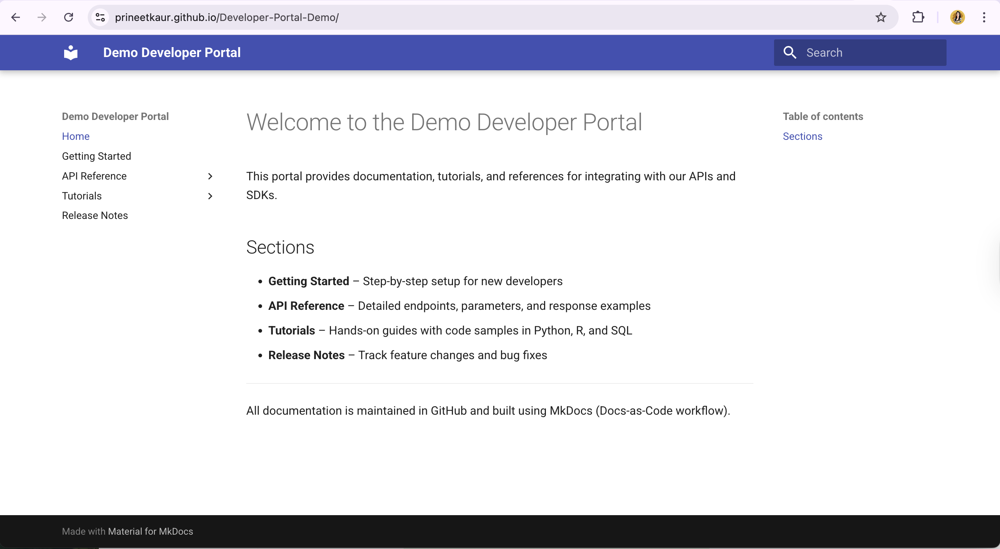

# Developer Portal Demo

(Screenshot of the Demo Developer Portal built using MkDocs Material)

This developer documentation portal demo was built with **[MkDocs](https://www.mkdocs.org/)**, using the **Material for MkDocs** theme.  
It demonstrates a clean, developer-focused documentation workflow with guides, tutorials, API docs, and release notes.

---

## Overview

This project shows how to create, organize, and publish documentation using a *Docs-as-Code* workflow — the same method used by many modern software teams.

**Highlights:**
- Markdown-based docs with instant live preview  
- Material theme for professional developer documentation  
- Fully deployable to GitHub Pages  
- Example pages for API references, tutorials, and release notes  

Live demo: **https://prineetkaur.github.io/Developer-Portal-Demo/**

---

## Folder Structure

```
Developer-Portal-Demo/
├── docs/
│   ├── index.md              # Home page
│   ├── getting-started.md    # Getting started guide
│   ├── payments.md           # Example API documentation
│   ├── release-notes.md      # Release notes example
│   └── tutorials/
│       └── tutorial1.md      # Tutorial example
├── mkdocs.yml                # MkDocs configuration
└── README.md                 # This file
```

---

## How to Run Locally

### 1️⃣ Install Python

Ensure **Python 3.8+** is installed:
```bash
python --version
```

### 2️⃣ Install MkDocs and Theme
```bash
pip install mkdocs mkdocs-material
```

### 3️⃣ Clone the Repository
```bash
git clone https://github.com/PrineetKaur/Developer-Portal-Demo.git
cd Developer-Portal-Demo
```

### 4️⃣ Serve Locally
```bash
mkdocs serve
```
Then open your browser at:  
👉 **http://127.0.0.1:8000**

### 5️⃣ Build Static Files
```bash
mkdocs build
```
This generates a `site/` folder containing the compiled HTML files.

### 6️⃣ Deploy to GitHub Pages
```bash
mkdocs gh-deploy
```
Your live site will be published automatically at:  
👉 **https://prineetkaur.github.io/Developer-Portal-Demo/**

---

## Tutorial: Add Your Own Docs

1. Create a new Markdown file under `docs/`, for example:
   ```
   docs/tutorials/my-new-tutorial.md
   ```

2. Add it to your site navigation in `mkdocs.yml`:
   ```yaml
   nav:
     - Home: index.md
     - Tutorials:
         - My New Tutorial: tutorials/my-new-tutorial.md
   ```

3. Save and preview it instantly with:
   ```bash
   mkdocs serve
   ```

---

## How This Project Works

This site uses **MkDocs** — a static site generator designed for documentation.

### Workflow Summary
1. Write docs in Markdown (`.md` files) inside the `docs/` folder.  
2. Configure layout and navigation in `mkdocs.yml`.  
3. Run `mkdocs serve` for local preview.  
4. Deploy to GitHub Pages using `mkdocs gh-deploy`.

MkDocs automatically builds the static site and pushes it to your repository’s `gh-pages` branch for hosting.

---

## Docs-as-Code Philosophy

This project follows a **Docs-as-Code** approach:
- Documentation lives in version control (Git)
- Markdown is used as the source format
- Site is automatically built and deployed via GitHub Pages

This allows writers and developers to collaborate using the same tools and workflows as engineers.

---

## Credits

Built with ❤️ using [MkDocs Material](https://squidfunk.github.io/mkdocs-material/).  
Created by [Prineet Kaur](https://github.com/PrineetKaur) as part of a documentation and developer advocacy learning project.
